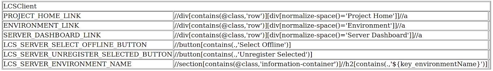

Paths (*.path)
==================

A Path is an element on a page in Liferay that a test will interact with. An element can be a button, text field, link, image, paragraph, or just about anything you would need to assert, click, or type into during a test. Each path is defined by the following:
#. Locator key: This is a descriptive label for what the element is (e.g. "CHECKOUT"). Locator keys are all-caps and use underscores instead of spaces.
#. XPath identifier: This is the address that points to that particular element in the HTML page (e.g. ``//button[contains(.,'Checkout')]``).

Path files are written in HTML in a very specific way that when rendered displays a table with the ``*.path`` title, a table containing the locator names and the locators. This was originally created so that the paths could be imported into Selenium IDE, which was the first tool used by Liferay QA to automate tests. The structure still remains the same today with the current Poshi framework.

|image0|

Folder/Directory Hierarchy
---------------------------

.. note::
  A lot of the path files/paths may not follow these rules below, as the decisions to place them in certain locations and the names of the files/locators are all subjective. Good |check| and bad |x| examples are listed to give examples of some files/locators that do not fit the expected standard.

#. `External`_
    These paths are paths for locators outside the Liferay instance, such as Gmail or Facebook paths
#. `Pathlib`_
    #.  `Elements`_
        These paths often relate to very basic UI areas, such as Buttons that are reused all across Portal.

        |check| `Button.path`_: `Buttons`_ are one of the simplest front end components within Liferay based off of Bootstrap, with many variations. They are also reused all across Portal so this fits here.

        |x| `Modal.path`_: `Modals`_ often contain many elements within them, such as the close icon, buttons to confirm and cancel, and sometimes alert messages. Even though this is a reusable component, it is too complex to be an element and should be in the section area instead.
    #.  `Section`_
        These paths are more complex UI areas, such as  a Portlet that are reused across Portal, and can often contain elements within them.

        |check| `Card.path`_: `Cards`_ are reused all across Liferay, and contain various icons as well as a dropdown menu within it, so it is a very good fit for this folder.

        |x| `Ratings.path`_: `Liferay Ratings`_ are displayed using the liferay-ui:ratings taglib, and doesn’t fit with the rest of the clayui based front-end components. This taglib is much more likely to change and is more component-specific within the asset module, and not really reused elsewhere.
#. `Plugin`_
    The paths here are for any legacy Liferay plugin features, however since we don’t use plugins anymore, the use of this directory is minimal.
#. `Portal`_
    These paths are for locators that are still on the portal instance, but not on the normal Liferay site. Some examples are the JSONWS API and the Setup Wizard. These locators are not commonly used.
#. `Portlet`_
    These paths are component-specific paths, and will likely contain most of the paths that everyone uses. A test writer can look through a component’s paths to use a specific path, however, there are no set standards in here so it can often be quite hard to find the one that is needed.

    .. warning::
      Be careful with re-using paths declared in this directory since there should be macros already implemented for that component to use its specific function. That way if the functionality of the component changes or if the path changes, the test will not break since fixing a locator will address the change.

      For example, if you want to go to the Web Content form to create a Web Content Article via the (+) button, the predefined macro can be used to click on the element without the need for clicking on the plus (+) button. This is because clicking on the button and/or clicking on the specified locator doesn’t promise that it will take you to the Web Content form, but a macro that says it will go to it can promise that.
#. `Util`_
    These paths have no real standard and some don’t fit in any of the other path locations. For example, some of the paths in Home.path are partial URLS, and a lot of the paths to OS.path are links to certain ``*.png`` files, likely used for Sikuli.

.. note::
  There is no simple way to find a path that is needed. Searching for a path file name using keywords or regular expressions to find desired patterns could be useful to find given paths. However, be careful when using a path that works for our current needs, because it can likely break in the future if it was meant to be used for a different object.

  There are no clear visual indicators on what a path is designed to find based on the name description. Therefore, searching for the correct macro to use and not reusing paths too often is highly recommended.

.. |check| image:: ./img/check.png
      :width: 15pt
      :height: 15pt
.. |x| image:: ./img/x.png
      :width: 15pt
      :height: 15pt

.. _`External`: https://github.com/liferay/liferay-portal/tree/master/portal-web/test/functional/com/liferay/portalweb/paths/external
.. _`Pathlib`: https://github.com/liferay/liferay-portal/tree/master/portal-web/test/functional/com/liferay/portalweb/paths/pathlib
.. _`Elements`: https://github.com/liferay/liferay-portal/tree/master/portal-web/test/functional/com/liferay/portalweb/paths/pathlib/uielements
.. _`Button.path`: https://github.com/liferay/liferay-portal/blob/master/portal-web/test/functional/com/liferay/portalweb/paths/pathlib/uielements/Button.path
.. _`Buttons`: https://clayui.com/docs/components/buttons.html
.. _`Modal.path`: https://github.com/liferay/liferay-portal/blob/master/portal-web/test/functional/com/liferay/portalweb/paths/pathlib/uielements/Modal.path
.. _`Modals`: https://clayui.com/docs/components/modals.html
.. _`Section`: https://github.com/liferay/liferay-portal/tree/master/portal-web/test/functional/com/liferay/portalweb/paths/pathlib/uielements
.. _`Card.path`: https://github.com/liferay/liferay-portal/blob/master/portal-web/test/functional/com/liferay/portalweb/paths/pathlib/uisections/Card.path
.. _`Cards`: https://clayui.com/docs/components/cards.html
.. _`Ratings.path`: https://github.com/liferay/liferay-portal/blob/master/portal-web/test/functional/com/liferay/portalweb/paths/pathlib/uisections/Ratings.path
.. _`Liferay Ratings`: https://github.com/liferay/liferay-portal/blob/master/modules/apps/asset/asset-publisher-web/src/main/resources/META-INF/resources/view_asset_entry_full_content.jsp#L259-L262
.. _`Plugin`: https://github.com/liferay/liferay-portal/tree/master/portal-web/test/functional/com/liferay/portalweb/paths/plugin
.. _`Portal`: https://github.com/liferay/liferay-portal/tree/master/portal-web/test/functional/com/liferay/portalweb/paths/portal
.. _`Portlet`: https://github.com/liferay/liferay-portal/tree/master/portal-web/test/functional/com/liferay/portalweb/paths/portlet
.. _`Util`: https://github.com/liferay/liferay-portal/tree/master/portal-web/test/functional/com/liferay/portalweb/paths/util
