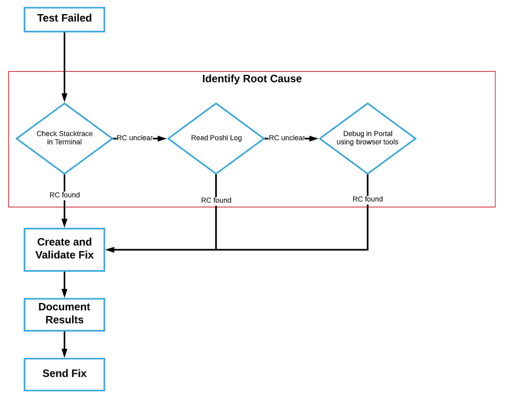
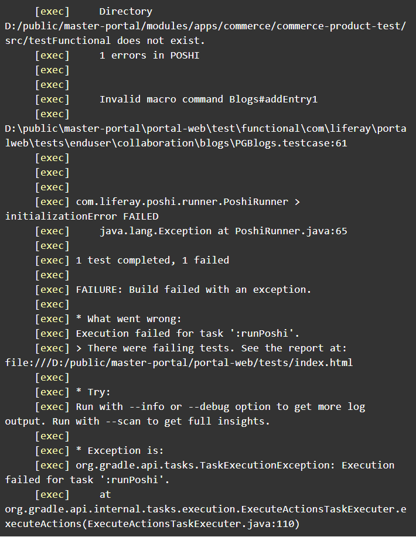
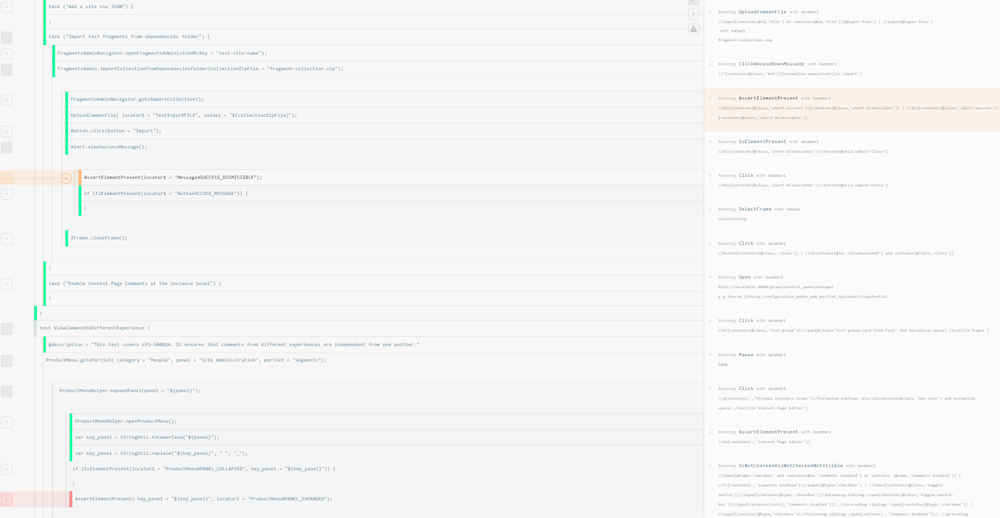
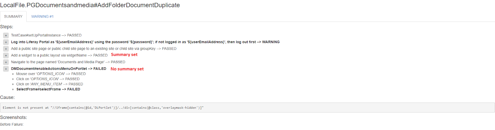

Debugging Poshi
================

After writing a test and running it, it is inevitable that a test would fail at some point. Tests can fail due to changes in code/UI or errors in test writing. This section describes what to do when a test fails.

Below is a general workflow to follow when a test you are executing locally fails.

|image0|

Identify the root cause of the test failure
--------------------------------------------

.. note::
  First and foremost, manually check that the test failure is not caused by bug. Once we have determined that the feature being tested works as expected, continue with the following.

1. **Check the terminal stacktrace.** Typically you want to start debugging by reading the stacktrace given by the terminal. It  will log the reason for the failure as the location of the failure when the test is run. This also gives you an opportunity to check if Poshi validation passed.

  **Poshi Validation**
  Poshi (syntax) validation is called by default before the test is actually run so if it catches any errors then these must be fixed before the test can actually execute. In the example below, an invalid macro command was caught on line 61 of PGBlogs.testcase.

  **Note:** Poshi validation is not foolproof, but it is reliable enough to catch all of the common Poshi scripting mistakes. More information about validation is found `here`_.
  |image1|

2. **Check the Poshi logs.** If reading the stacktrace is not enough to determine the root cause, navigate to the Poshi test result directory to read its logs.

  **Poshi Logs**
  After test execution, Poshi reports for the run will be generated in the \portal-web\test-results directory. Here you will find a folder with the name of the test that you ran (i.e. LocalFile.PGBlogs_AddBlogsEntry).

  .. note::
    Every time you run a Poshi test the files in this directory will be cleaned out, so make sure to preserve these files elsewhere in case you need them later.

  Inside this folder, you will find two Poshi files:

  a. **Index.html**
    This is the file generated by the Selenium logger that displays the runtime details for the test (to watch this logger execute during runtime, set ``test.selenium.logger.enabled=true`` in test.properties). Some styling and Javascript is applied to the HTML file to help better visualize and interact with the progression of the test. Each step executed is highlighted with one of the following colors:
    |image2|

    **Green**: This step passed with no errors
    **Orange**: This step passed functionally, but caught non-functional errors
    **Red**: This step failed

    The left container of the log displays the Poshi script that was run. The syntax is rolled up to the highest level and is expandable. If there are errors detected during runtime, the log will automatically expand the relevant lines to detail the line where the failure occurs.

    The right container of the log displays the Selenium functions executed by Poshi script.

    The log is interactive. Clicking on any function either on the right or left will automatically adjust the focus of both containers to where that function resides in the test log.

    When an error is detected, Poshi runner takes before and after failure screenshots. These screenshots are displayed when clicking on the ``[!]`` icon in the log next to the failure. The raw files are stored in ``portal-web\test-results\[Test]\screenshots``.
  b. **Summary.html**
    This file renders the Poshi test case into human-readable language based on the summaries @summary = that have been set at the macro level. If no summary is set, then the raw macro syntax will be used.
    |image3|
3. **Debug Portal using browser tools.** Functional tests are very fragile because simple changes to the page markup could quickly cause previously written xpaths to become obsolete.  To check for xpath integrity, the following tools are recommended:
  +---------+----------------------------+-------------------------------------------------------------------------------------------------+
  | Chrome  | Chrome Dev Tools           | - Native debugging tool for Chrome.                                                             |
  |         |                            | - Found in Toolbar > More Tools > Developer tools.                                              |
  |         |                            | - Alternatively you can right-click in Chrome > Inspect to bring up the console for debugging.  |
  +         +----------------------------+-------------------------------------------------------------------------------------------------+
  |         | `ChroPath`_                | - Once installed, this can be found in the Chrome console.                                      |
  |         |                            | - This tool returns the absolute and relative xpaths of any element on the page.                |
  +         +----------------------------+-------------------------------------------------------------------------------------------------+
  |         | `Selenium IDE for Chrome`_ | - This ready-to-use IDE allows you to quickly record, execute, and debug Selenium/Poshi scripts |
  +---------+----------------------------+-------------------------------------------------------------------------------------------------+
  +---------+----------------------------+-------------------------------------------------------------------------------------------------+
  | Firefox | Firefox Dev Tools          | - `Firebug`_ has been integrated into this                                                      |
  +         +----------------------------+-------------------------------------------------------------------------------------------------+
  |         | `ChroPath for Firefox`_    |                                                                                                 |
  +         +----------------------------+-------------------------------------------------------------------------------------------------+
  |         | `Selenium IDE for FF`_     |                                                                                                 |
  +---------+----------------------------+-------------------------------------------------------------------------------------------------+

Create/Validate Fix for the Test
-----------------------------
Once the root cause of the test failure is determined, create a fix for it and validate your test by running it locally or against CI.

**Debugging with CI**
This assumes the Liferay webhook has been added to your Github repository and that you will be testing against your own repository. To set this up, `see the guide here`_.
  1. Specify which batches/environments should be run in test.properties
  2. Set PQL properties for test(s) that need to be run
  3. Commit test.properties and test files
  4. Send a pull to yourself and trigger a relevant test suite to run your tests

Document Results
-----------------
Once the fix has been validated, store the results on the JIRA ticket you are working on. If you ran a test locally, upload the Poshi log file that ran green. If you tested against CI, include a link to those test results. This will help later test writers confirm that the test, at this point in time, was fixed.

.. _`here`: https://github.com/liferay/liferay-portal/blob/fbf0974749b7db71504fca52a077d5c6c64242a6/modules/test/poshi-runner/poshi-script.markdown#debugging-syntax-errors
.. _`ChroPath`: https://chrome.google.com/webstore/detail/chropath/ljngjbnaijcbncmcnjfhigebomdlkcjo?hl=en
.. _`Selenium IDE for Chrome`: https://chrome.google.com/webstore/detail/selenium-ide/mooikfkahbdckldjjndioackbalphokd
.. _`Firebug`: https://github.com/firebug/firebug
.. _`ChroPath for Firefox`: https://addons.mozilla.org/en-US/firefox/addon/chropath-for-firefox/?src=search
.. _`Selenium IDE for FF`: https://addons.mozilla.org/en-US/firefox/addon/selenium-ide/?src=search
.. _`see the guide here`: https://grow.liferay.com/people/Pull+Request+Tester+for+Liferay+Developers
