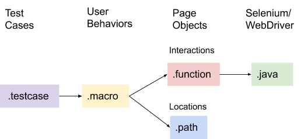

Poshi Layers
=============

|image0|

LiferaySelenium/WebDriverImpl (.java)
--------------------------------------
The first and lowest Poshi layer is where WebDriver is implemented in Java. The base class `BaseWebDriverImpl`_ implements both `WebDriver`_ and our own custom interface of selenium methods called `LiferaySelenium`_. Many of the custom methods give the Liferay tester additional functionality, such as ``waitForConsoleTextPresent``, which allows us to check for output in the application server log during test runtime.

Building reliable and reusable functions (.function)
-----------------------------------------------------
While the Java layer has many custom and unique methods, we have reached a point where the base layer is stable and rarely needs any changes. This is partly due to our second layer we call "functions". Functions use a simple syntax to allow testers to combine the basic methods defined in the Java layer to create reusable functions for test cases, no Java experience required.

For example, the function layer may have a function that first waits for a specific type of page load, clicks an element, and then confirms that no console errors were thrown due to that interaction. These are 3 different Java methods combined to make 1 more practical method for the tests. The tests will normally access the Java layer through the functions defined in this layer.

A real example would be Poshi's basic "Click" function:
::
  Click.function
  @default = "click"
  ...
  function click {
	   WaitForSPARefresh();

	   selenium.waitForVisible();

	   selenium.mouseOver();

	   selenium.click();

	   selenium.assertJavaScriptErrors();

	   selenium.assertLiferayErrors();
  }

The selenium methods are all from the Java layer, and this also combines another custom function: ``WaitForSPARefresh()`` which accounts for Liferay's SPA framework, improving reliability by making sure the page has fully loaded.

The test writer would then simple call this new function "Click" in a test with an xpath locator (a method of looking up elements in the HTML page). The function must know what element or page object to Click on. This locator is implicitly passed into the java layer as a String.
::
  Click(locator1 = "//button[contains(.,'Close')]");

Defining Page Objects (.path)
-----------------------------
The problem with the usage of the function above, is that the locator is hardcoded. The xpath points to a specific location in the HTML. While unlikely in this example, the markup might change and now all function calls on this locator must be updated. Instead of hardcoding locators inside of each test, Poshi defines and maintains page object locators in a single type of file in Poshi, called the "path" layer. These locators are then assigned to a property name to be used when calling functions.

This layer only contains xpaths and names for each "path". Each path file is named after some element type, portal page, or component. Paths are referenced in function calls by the format: ``PathFileName#PATH_NAME``.

There is a solution for the hardcoded locator in the example above. In `Button.path`_, the xpath is defined for "Close" buttons in the portal. Any function can interact with the "Close" button page object by referencing the Button#CLOSE path.
::
  Click(locator1 = "Button#CLOSE");

At Liferay, we have chosen to only use xpath locator to find elements (instead of other types such as CSS or Id locators). Xpath locators allow for both precise and flexible locators because they can be `exact or relative HTML/XML lookups`_.  Additionally, the single locator type allows Poshi to be simpler to understand for new test writers.

We also encourage test writers to create paths that are specific enough to find the right object, but general enough that they are reusable throughout the project under test. Path file names must be unique, but this allows any test writer to have access to any path. The goal is to create a library of test objects for the product that make tests easier to read and maintain.

Scripting User Behaviors (.macro)
----------------------------------
Page object interactions are defined in the "function" layer, while page object locators are defined in the "path" layer. The actions and locators are brought together in the "macro" layer. Here is where functions are called and user interactions defined. Anything from clicking on a button, to performing navigations, to reading information, or even sending API calls to improve test setup speed. All of this logic is defined as "macros". Macros are primarily made up of function calls on existing paths to simulate the behavior of a user (e.g. Login, Add a Blog, etc.)

Macros files are generally named after components or parts of components. For example, Liferay has a blog writing and publishing feature. Part of that feature is the individual blog entry. `BlogsEntry.macro`_ defines all the user interactions with the entry. The user might need to flag a blog entry for violation of the Terms of Use. A user interaction, "flagPG" (PG means "Page") is defined in `BlogsEntry.macro`_. This macro is now available as a user interaction that can be executed in a test for flagging blogs entries on a page.

.. note::
  Some macros or tests have a PG or CP notation attached to it. For example, the macros ``KBArticle#deletePG`` and ``KBArticle#deleteCP``. PG stands for Page, and CP stands for Control Panel. These hail back to previous portal versions where the behavior or path of similar elements were different depending on whether the action was being done on a widget on a page or on the control panel. So on the KBArticle example, deletePG indicates that the Knowledge Base article is deleted via a widget on a page and deleteCP indicates that the Knowledge Base Article is deleted in the Control Panel (Admin page).

Writing Test Cases (.testcase)
-------------------------------
Now that all the webdriver/selenium interactions are written, the functions are created, the page object locators are defined, and the user behavior scripted - a test writer is now able to simply write a test case combining user interactions to make sure that the Portal is behaving as expected. A test case is primarily a combination of macro calls with any variable values defined.

The example BlogsEntry macro might be used in a test case like this:
::
  @priority = "4"
	test UserFlagsBlogEntry {
		...
		Navigator.gotoPage(pageName = "Blogs Page");

		BlogsNavigator.gotoEntryPG(
			entryContent = "Blogs Entry Content",
			entryTitle = "Blogs Entry Title");

		BlogsEntry.flagPG(
			flagReason = "Spam",
			siteName = "Test Site",
			userEmailAddress = "userea@liferay.com");
		...
	}
This example shows part of a test case where the user is navigating to a page, navigating to a specific blog entry, and then flagging the entry for "Spam".

Test case files also define setup steps, teardown steps, properties,  individual test priorities (see example), and more. Generally a test case file will be organized around a component or component group and often contain multiple test cases. See `example test case for the Calendar component`_.

.. _`BaseWebDriverImpl`: https://github.com/liferay/liferay-portal/blob/master/modules/test/poshi-runner/poshi-runner/src/main/java/com/liferay/poshi/runner/selenium/BaseWebDriverImpl.java
.. _`WebDriver`: https://seleniumhq.github.io/selenium/docs/api/java/org/openqa/selenium/WebDriver.html
.. _`LiferaySelenium`: https://github.com/liferay/liferay-portal/blob/master/modules/test/poshi-runner/poshi-runner/src/main/java/com/liferay/poshi/runner/selenium/LiferaySelenium.java
.. _`Button.path`: https://github.com/liferay/liferay-portal/blob/7b453718d11cdefaa9fa25f2fe3d8ec9b3428dbc/portal-web/test/functional/com/liferay/portalweb/paths/pathlib/uielements/Button.path#L146-L150
.. _`exact or relative HTML/XML lookups`: https://www.seleniumeasy.com/selenium-tutorials/xpath-tutorial-for-selenium
.. _`BlogsEntry.macro`: https://github.com/liferay/liferay-portal/blob/7b453718d11cdefaa9fa25f2fe3d8ec9b3428dbc/portal-web/test/functional/com/liferay/portalweb/macros/BlogsEntry.macro#L315-L347
.. _`example test case for the Calendar component`: https://github.com/vicnate5/liferay-portal/blob/50041f13102402771a777ae5e31e3364d3ae2b32/portal-web/test/functional/com/liferay/portalweb/tests/enduser/calendar/pgcalendar/CalendarCreateEvent.testcase
